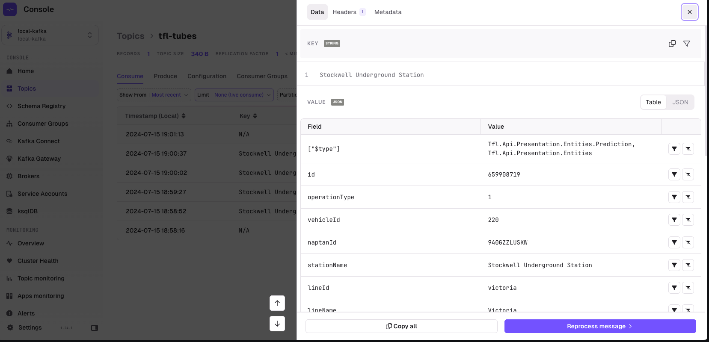

# simply-kafka
Some simple explorations, providing easy to understand reusable examples to get to grips when starting with Kafka.

# TFL Tube Stream
Data generator, live stream of data from the next tube approaching the Stockwell underground station from the Transport for London API.

This can be used as a Kafka producer for the local stack when an internet connection is available.

Steps involved in it's creation included:
1. Navigating the TFL [documentation](https://api-portal.tfl.gov.uk/api-details#api=Line&operation=Line_ArrivalsByPathIds&definition=Tfl-41) site to find what endpoints held the data I wanted, how frequently it's updated and how to auth to the API
1. Query the TFL API to grab the station codes depending which station I wanted to watch
1. Query another part of the API to get the tube data, in this case incoming Victoria line tubes to Stockwell station
1. Improve the reliability by building in back-offs and what to do with empty responses
1. Capture and transform the API response into a usable JSON message 
1. Produce the JSON message into Kafka

*Screenshot of my app polling the TFL API.*

*Screenshot from Conduktor's UI of the message in Kafka.*

This leverages an adjusted [Conduktor](https://www.conduktor.io) Docker compose stack for local development, containing a Kafka cluster tooling.

# Acknowledgements
[Aiven](https://github.com/Aiven-Labs/python-fake-data-producer-for-apache-kafka) and [Quix](simple-kafka-python) for some producer & consumer examples to model my own around.